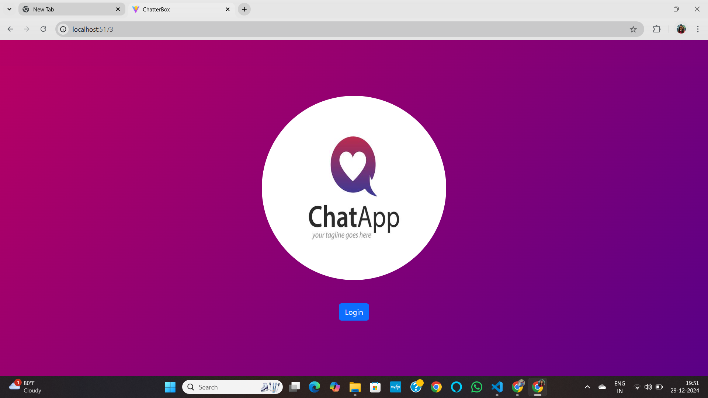

# React + Vite Chat App

A real-time chat application built using React and Vite, designed to offer a seamless and user-friendly communication platform. The app supports multiple users, real-time messaging, and a modern UI.

This template provides a minimal setup to get React working in Vite with HMR and some ESLint rules.
Currently, two official plugins are available:

- [@vitejs/plugin-react](https://github.com/vitejs/vite-plugin-react/blob/main/packages/plugin-react/README.md) uses [Babel](https://babeljs.io/) for Fast Refresh
- [@vitejs/plugin-react-swc](https://github.com/vitejs/vite-plugin-react-swc) uses [SWC](https://swc.rs/) for Fast Refresh

## Features
- Real-time messaging
- Responsive and modern UI
- User authentication with [Firebase/Auth0/Other]
- Emoji support
- Persistent chat history

## Tech Stack
- **Frontend**: React, Vite, Tailwind CSS (or other UI library)
- **Database**: Firebase/Firestore.
- **Other Tools**: Socket.IO (for real-time communication), Redux (for state management)

## Screenshots

Here's a screenshot of the application:

